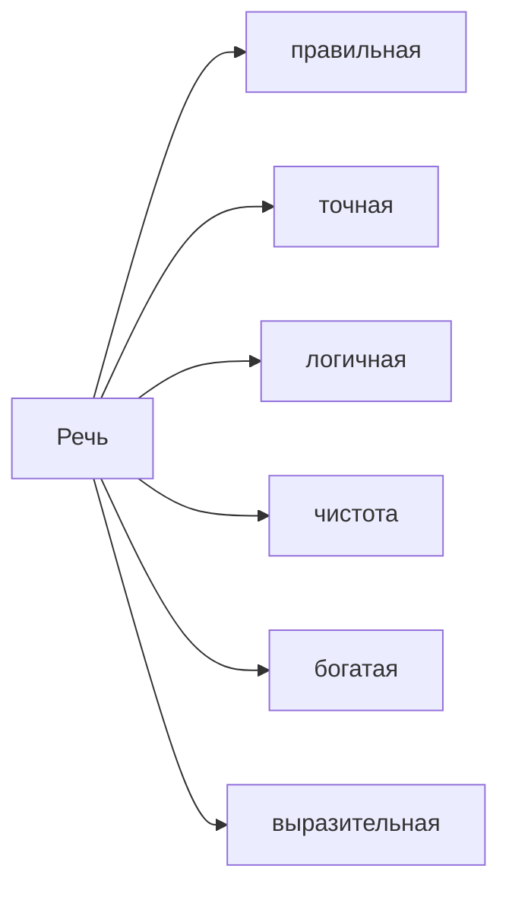

# Лекция № 1 Практическая стилистика

  

Каким должен быть редактор в первую очередь:

1. Грамотным
2. Внимательным
3. Эрудированным
4. Иметь аналитический склад ума

  

Расщепляется сегодня представление о грамотности, на традиционную грамотность и цифровую. Приверженцы традиционной грамотности, говорят. Грамотность как хороший костюм как хорошие манеры. Это не обсуждается. 

  

Надо ли сравнивать цифровую грамотность и грамотность традиционную. 

  

  

>[!note] 
>Норма это совокупность выработанных общественно-речевой практикой действующий в данный период существования литературного языка, правил употребления слов, сочетаний слов, грамматически форма и конструкций, совокупность правил произношения и написания слов. 

  

  

Иногда мы намеренно нарушаем нормы и достигаем поставленный эффект. Нарушение нормы почти всегда базируется на нарушении устойчивых законов. Если это нарушении достигает своей цели. 

  

Одной из задач наших будет когда норма нарушена. 

  

>[!important] 
>Верно выстроенный текст читается слева направо сверху вниз однократно. </spam>

  

 Правильно выстроенный текст не вызовет такого нарушения. 

  

У нас есть журналисты, которые обыгрывают слова, над которыми вообще не следует. Например над смертью Сергея Перхуна "Не вышло поле перейти". 

  

Обязательный учёт факторов коммуникации. Где общение, с какой целью общение и т. д.

  

В нашем случае функции стиля и жанровые формы. 

Стилям будет посвящено несколько занятий. 

  

Точность и ясность достигается словами которые закреплены и воспринимаются большинством носителей этого языка. 

Простота. 

  

Правильность  
соответствие литературной-языковым нормам. 

Богатство.
Используйте разнообразные языковые средства, избегайте неоправданного повторения слов, одинаковых по строению конструкций. 

Точность
соответствие мыслям говорящего, конкретность. 

Чистота. 
устранение из речи нелитературных, жаргонных, вульгарных, иностранных, употребляемых без особой необходимости. Слов паразитов. 

Логичность. 
соответствует законам логики, обоснованностью выдвигаемых положений. 

Выразительность.
Подбирайте слова и предложения наиболее ярко передающие ваши мысли, воздействующие на адресата речи

[[Лекция № 1 Практическая стилистика]]

[Лекция № 1 Практическая стилистика](https://github.com/denisbolshakoff/MSU/blob/main/Практическая%20стилистика/Лекция%20№%201%20Практическая%20стилистика.md)

