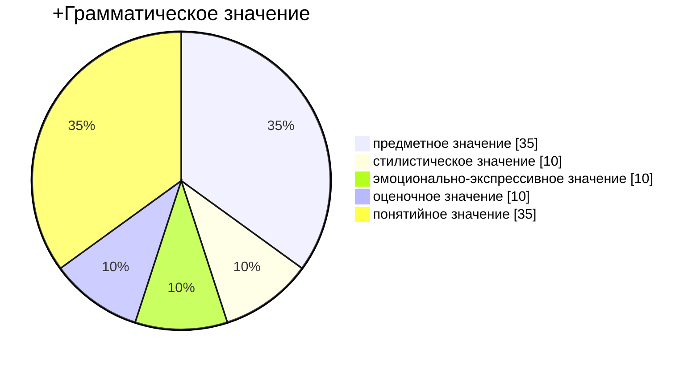

# Лекция № 5 Практическая стилистика

## Лексическая стилистика

Проблема выбора слова. 

Виды стилистических ошибок
1. Смешение стилей
2. Выбор слова без учёта лексического значения
3. Использование несуществующего слова (создание "по незнанию" или по созвучию)
4. Смешение полярных оценочных значений слов
5. Анахронизм
6. Тавтология
7. Плеоназм
8. Лексическая недостаточность
9. Нарушение лексической сочетаемости
10. Контаминация (совмещение элементов  двух устойчивых оборотов)
11. Неудачных выбор синонима
12. Неправильное использование антонимов
13. Неоправданно использование канцеляризмов
14. Использование штампов
15. «Неряшливая» метафора (неудачное использование многозначного слова)
16. Неуместная двусмысленность 
17. Немотивированное использование заимствованного слова (неудачный выбор синонима) 
18. Неправильное использование иноязычного слова (вследствие незнания его лексического значения или из-за созвучия с другим словом) 
19. Смешение паронимов 
20. Алогизм («то, чего на белом свете вообще не может быть») 
21. Неоправданное разрушение фразеологизма
22. Контаминация фразеологизмов
23. Подмена понятия

Один и тот же речевой факт,

Абстрактные понятия обычно обладают понятийным значением. 

[[Лекция № 4 Практическая стилистика]]    [[Лекция № 6 Практическая стилистика]]

[Пред. Лекция № 4 Практическая стилистика](https://github.com/denisbolshakoff/MSU/blob/main/Практическая%20стилистика/Лекция%20№%204%20Практическая%20стилистика.md)     [След. Лекция № 6 Практическая стилистика](https://github.com/denisbolshakoff/MSU/blob/main/Практическая%20стилистика/Лекция%20№%206%20Практическая%20стилистика.md)