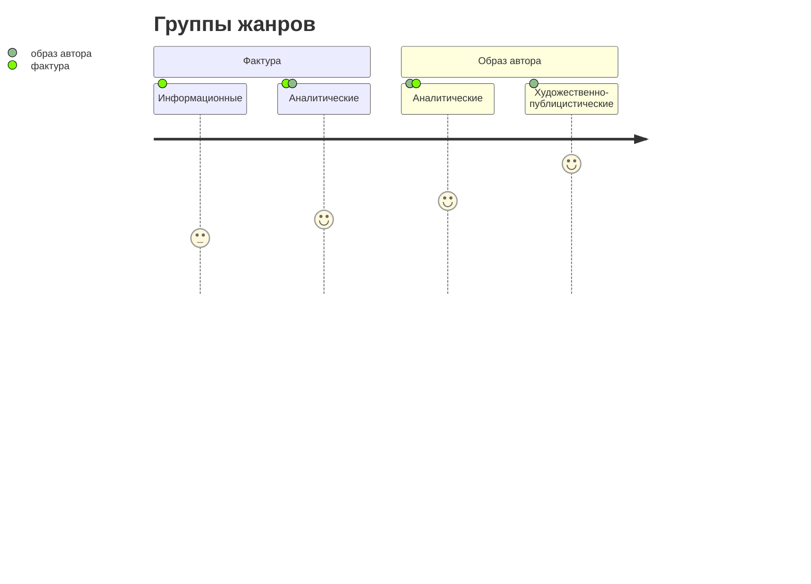

# Лекция № 4 Работа над структурой медиатекста

Редактор, который будет работать с чужим текстом должен представлять какой конкретно будет речевой акт коммуникации. 

Основные группы жанров:
* Информационные
* Аналитические
* Художественно-публицистические

Устойчивость журналистских жанров, потому что чередование экспрессии и стандарта очень сильно прижился. 

Информационные жанры:
* Хроника
* Дайджест
* Отчёт
* Анонс
* Новость (заметка)
* Некролог
* Комментарий
* Обзор
* Обозрение
* Интервью
* Репортаж

Аналитические жанры:
* Статья
* Рецензия
* Аналитический обзор
* Аналитическое интервью
* Аналитический репортаж
* Аналитический комментарий

Художественно-публицистические жанры:
* Зарисовка
* Эссе
* Очерк
* Фельетон
* Памфлет
* Авторская колонка

[[Лекция № 3 Работа над структурой медиатекста]]   [[Лекция № 5 Работа над структурой медиатекста]]

[Пред. Лекция № 3 Работа над структурой медиатекста](https://github.com/denisbolshakoff/MSU/blob/main/Работа%20над%20структурой%20медитекста/Лекция%20№%203%20Работа%20над%20структурой%20медиатекста.md)       [ След. Лекция № 5 Работа над структурой медиатекста](https://github.com/denisbolshakoff/MSU/blob/main/Работа%20над%20структурой%20медитекста/Лекция%20№%205%20Работа%20над%20структурой%20медиатекста.md)