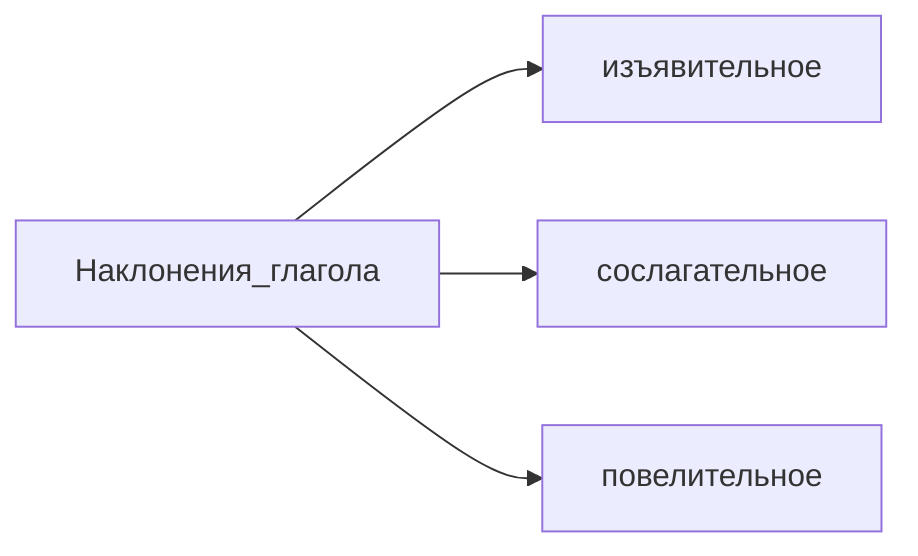

# Лекция № 1 Синтаксис русского языка

Курс как редакторам пронизан разговорами о пунктуации. Потому что любая система основна на пунктуации. 

**Книги Русский язык и культура речи. Синтаксис. Под ред. Проф. Солганика.**

  

Существует более серьезный учебник, которые создала 

**Н. С. Валгина. Синтаксис современного русского языка.**

Валгина -- это максимум что могла бы пожелать преподаватель. 

  

**Панюшева Шалимова Современный русский язык. Зеленый по синтаксису. Коричневый по пунктуации**

  

Наш курс -- это поле которое должны возделать в течение года. 

  

>[!note] 
>Синтаксис -- раздел грамматики, который изучает строй связной речи

>[!important] 
>Синтаксис -- язык как средства общения и единица рассмотрения будет как коммуникативная единица языка. 

Синтаксические единицы. Первое что будет обсуждать. Первая мельчайшая синтаксическая единица -- словоформа.

  

>[!note]
>Словоформа -- это слово, поставленное в определенную грамматическую форму. 

  

Словоформа или синтаксема, чтобы оно могло сосуществаоть с другими словами. 

  

  

Вторая синтаксическая единица, называется словосочетание. 

>[!note] 
>Словосочетание -- сочетание как минимум двух слов, посредством подчинения.

  

Ни словоформы, ни словосочетания не могут выражать законченную мысль. А мысль -- это уже предложение. И мы будет заниматься синтаксисом простого предложения. 

  

Предложение может быть выражено таким словом, которое мы не можем выразить даже частью речи. Но это слово обретает смысл только в контексте. 

  

  

>[!note] 
>Предложение -- это единица синтаксиса, которая способно выражать относительно заточенную мысль. В предложении обычно есть подлежащие и сказуемое -- основа предложения. 

  

Любое предложение является предикативным. Предикат -- это сказуемое. Поскольку в любой предложении есть сказуемое, в любом сказуемом есть глагол. 

  

Носителем предикативности является сказуемое. И поэтому в любом предложения будет присутствовать предикат. 

>[!note] 
>Предикативность -- это способность преподносить реальность. Это как предложение преподносит реальность. 

  

Модальность, время и лицо и из них складывается понятие предикативности. Реально или ирреально описываемому случаю. 

  

  

Наклонения у глагола три: изъявительное, сослагательное (условное) и повелительное. 

Модальность предложения -- это синтаксическая категория выражается в форме глагола. 

  

Изъявительное -- модальность реальная. 

  

Условное или сослагательное -- когда действие воображаемое (я бы сейчас выпил кофейка). Модальность предложения -- ирреальная. 

  

Повелительное наклонение  - подойти ко мне, скажи мне правду. Ирреальная модальность. 

  

Вторая составляющая -- время. Время предложения.

  

Время -- это не синтаксическая конструкция. 

  

  

Предикативность:

1. Модальность

2. Время предложений 

3. Синтаксическое лицо

  

Бывает такое, что предложение является языческим.

  

Сверхфразовое единство -- единство соседствующих предложений. Это то, что в нейтральной речи мы понимаем под словом абзац (микротема). Самая крупная синтаксическая единица -- текст. Свойство относительно завершенную мысль. 

  

В простом предложении 5 синтаксических свойств

1. Предикативные связи. 

2. Второстепенный член -- это зависимые член словосочетания

3. Сочинительная Связь между однородными членами предложения.

4. Полупредикативная связь. Полупредикативная связь связана с обособлением членов предложений. Что мы обособляем "Осенью, в дожди, река станет опасной"

5. Присоединение. "Ты меня обидел, и напрасно". Присоединение -- это "Я отдала ему тетрадь", "Я отдала тетрадь ему".

  

  

  

Пунктуация -- правила постановки знаков препинания.

Все знаки препинания Делятся на две группы, отделяющие и выделяющие. 

  

Отделяющие -- однократно, выделяющие -- парно. 

  

Отделяющие -- знаки конца предложения: ".", "!","?"  

  

Отделяющие знаки: ",", ";", "-", "(", ")", """, """. 

  

Для чего нам нужны знаки препинания. 

1. Знаки препинания нужны для организации текста. 

2. Семантический. Знаки препинания Влияют на смысл.

  

  

Каждый знак препинания -- имеет свой функционал. 

  

Например двоеточие, ставится в трех ситуациях,

1. Обобщающие слово. 

2. В бессоюзном сложной предложении при объяснительных отношениях, когда вторая часть объясняет первую. 

3.  Прямая речь. 

  

Двоеточие страдает из-за безобразного употребления терминов. 

  

  

>[!important] 
>Д/З взять учебник и прочитать параграф глава 5. Вспомнить какие бывают формы сказуемого, какие бывают подлежащие. И по зеленой книжке Панюшева Шалимова современный русский язык. Упражнение 26, подлежащие, упражнение 47 сказуемые. 

  
[[Лекция № 2 Синтаксис русского языка]]

[Лекция № 2 Синтаксис русского языка](https://github.com/denisbolshakoff/MSU/blob/main/Синтаксис%20русского%20языка/Лекция%20№%202%20Синтаксис%20русского%20языка.md)