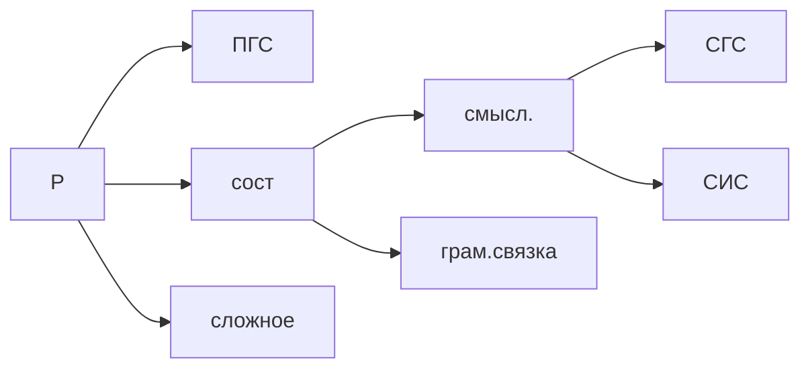

# Лекция № 2 Синтаксис русского языка

Что такое **подлежащее**. Мало того, что существительное, так ещё и в именительном падеже. Если это часть речи имеет падеж, местоимение или существительное обязано стоять в именительном падеже. 

>[!note] 
>Подлежащее -- обозначает предмет рассуждение. То о чём идёт речь. 

Поэтому когда нам нужно разбирать предложение, нам нужно искать существительное в именительном падеже. А бывает что подлежащее выражено инфинитивом глагола. 

> строить мосты -- его признание

Инфинитив -- очень часто бывает подлежащим. Предмет рассуждения. 

Чем только подлежащее не выражается. 

>[!important]
> Субстантивация -- любое слово употребляется в виде подлежащего. 

Можем сконструировать предложение даже из междометий 

> ах и ох -- это междометия

Один из сложнейших ситуаций, когда подлежащее выражено. 

В сказуемом всегда новая информация, оценка. 

Сказуемое -- это сердце предложения. 

 ПГС -- простое глагольное сказуемое (не всегда однословное)

 сост (составное сказуемое) -- всегда двухчастное, одна часть называется грамматическая связка, вторая часть -- смысловая.

 СГС -- составное глагольное сказуемое

 СИС -- составное именное сказуемое

 сложное состоит из трех и более частей

К аналитической форме глагола относится повелительная форма глагола. Простое глагольные сказуемые в форме повелительного наклонения.

>[!warning]
>Упражнение №5 по Розенталю 

[[Лекция № 1 Синтаксис русского языка]]

[Пред. Лекция № 1 Синтаксис русского языка](https://github.com/denisbolshakoff/MSU/blob/main/Синтаксис%20русского%20языка/Лекция%20№%201%20Синтаксис%20русского%20языка.md)