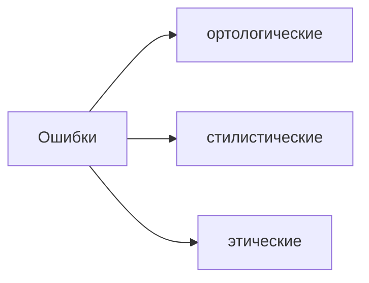

# Лекция № 1 Современный русский язык

Странности словоупотребления русского языка

Источниками странности из любых сфер коммуникаций, домашних разговоров, медиасфера или беллетристика. Может стать источником этих примеров. 

  

>[!tip] Контрольная работа
>Высылается дней за 10 и на последнем занятии семестра подводим итоги. 

Сроки сдачи заданий в течение семестра. Говорится, в том числе и для того, чтобы люди, которые имеют филологическое образование могли собрать эти примеры и считать что дело сделано. Если не уверены или не филологическое образование, хотите набраться знаний, то к концу семестра. 

  

Задание по поиску странностей. Чтобы каждый из вас в аудитории каждый мог примеры привести. Чтобы сложилось общее впечатление, что такое странно с точки зрения русистики русского языка. 

  

>[!warning] Задание
> присылать с фамилией слушателя.

  

Досье странностей -- досье "странностей". О нормативности общения в принципе и об общении на русском национальном языке. Это отклонение от нормы, как он пишет, как он общается. Слово странность -- ёмкое, отклонение от нормы от большой иерархии норм. Оформлять в виде таблицы

|№|Странность|Комментарий|Оценка (экспрессема, Либо ошибка: ортологическая., стилистическая, этическая. )|
|---|---|---|---|
|||||

  

Оценка в четвертом разделе таблицы -- это лично ваша оценка. Экспрессема, либо ошибка. Либо ошибка против стилистической нормы, но не против литературной. 

Литературные или ортологические нормы. Отличить эти нормы от стилистических. 

  

Литературные или ортологические имеют уровневое. От фонетики, буквы, интонации, единицы морфемы слова и формообразования. Потом единицы номинации -- слова и словосочетания.  Нормы есть для всех уровней языка. 

  

Стилистические нормы тоже довольно разнообразны. 

  

Одним из типичных нарушения закона тождества является троп. 

>[!info] Троп 
>-- это где слово употребляется в переносном смысле. Будем изучать метафора, метонимия, и синекдоха. Оксюморон -- "горячий снег". Отклонение от нормы является уже стандартом общения. То есть троп стал частью нормальной речи.  

  

Онтологическая норма -- когда мы понимаем, что в мире происходит, но в тексте упоминаем наше понимание объекта. 

  

  

Странности которые будем обнаруживать в тексте, связано, что событие странное или события странно подается. 

>"Лоси установили связь с космосом"

лосей чипировали и отслеживают передвижения через спутники. 

Кликбейтная модель -- и одна из моделей  -- это раскрытие небывальщины. 
  
Эта странность которую мы можем обозначить как систему норм. 

  

На следующее занятие найти по две странности и эти странности пойдут в досье. И эту странность классифицировать. 

  

  

Система норм языковые, онтологические, коммуникативные логически, этические. 

  

  

Нужно уметь выискивать странности и её характеризовать.