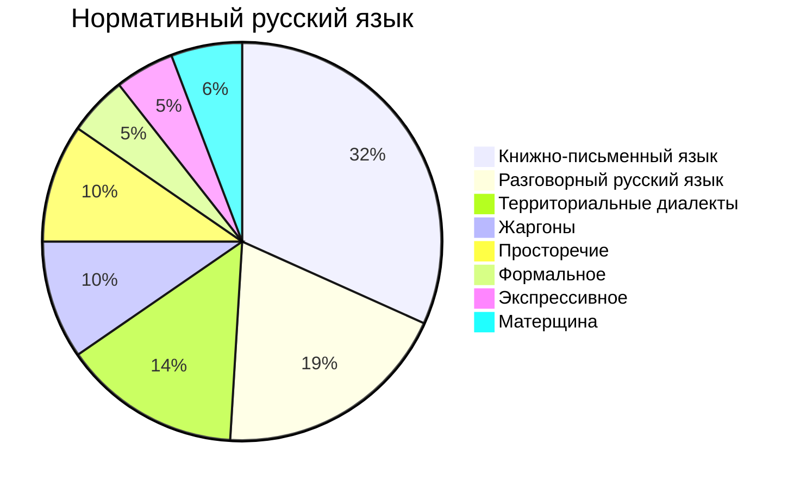
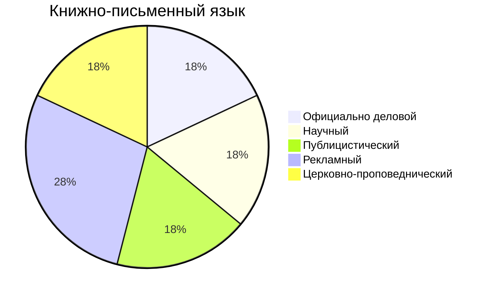

# Лекция № 5 Современный русский язык

## Характеристики современного русского национального языка

### Закономерность русского языка
### Типологические характеристики и совместить с типологическими характеристиками 

Функциональное расслоение русского языка. На основании его уровневой системы, где обнаруживаются единицы от звуков и букв до синтаксиса. Все эти общности складываются в общение на русском языке.

В рамках индоевропейского языка. 

Литературный русский язык стал государственным. 

[[Лекция № 4 Современный русский язык]]

[Пред. Лекция № 4 Современный русский язык](https://github.com/denisbolshakoff/MSU/blob/main/Современный%20русский%20язык/Лекция%20№%204%20Современный%20русский%20язык.md)