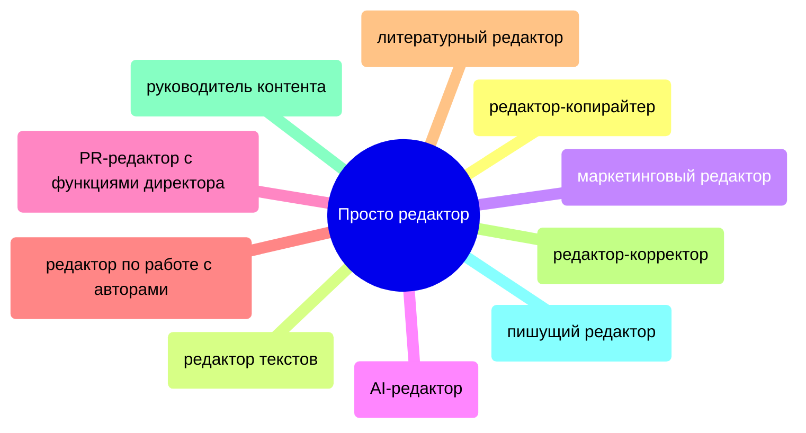
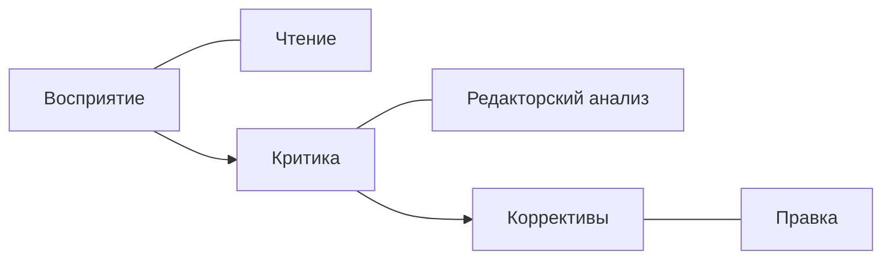
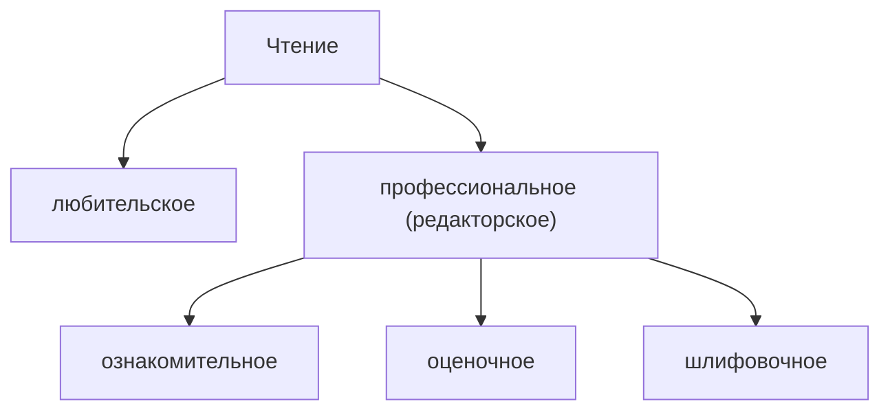

# Лекция № 1 Технологии редактирования

Идеология редактирования. Догм нет. И есть возможность что-то обсуждать.

Редактор -- считает редактирование профессией и считает целесообразным ориентироваться на профессиональные установки.

Сейчас стало ещё менее однозначным чем пять-десять лет назад.

Редактирование находится в очень непростой позиции. Этот функционал мега-вариативен. Работодатель вкладывает в этот функционал всё что считает нужным.

Проблема с редактированием начались не вчера. Ровно столько сколько Иншакова занималась редактирование наблюдала все метаморфозы этой профессией. 

Редактор приравнивалось к профессии идеологической. 

**Лидия Корнеевна Чуковская - В лаборатории редактора.**

Редактор должен иметь должен быть редакторского образование или это специалист предметной области. 

Работодатель ищет на HH медицинского редактора, сельскохозяйственного редактора, художественного редактора и т. д. Ведутся споры по этому поводу насколько профессионально делать такие вакансии. 

Всё то, что делает профессию профессией совокупность определенных приёмов и навыков и которыми нельзя овладеть по щелчку. Но лучше приступать к редактированию с необходимыми навыками. 

Методическая основа профессии абсолютная и закономерная.

**Мильчин А. Э. - Методика редактирования текста. М.: Логос, 2010.** 

Чем занимается редактор:
1. Tone of voice
2. Анализ конкурентов рынка
3. Выстраивание контента-блога
4. Создание контент-плана
5. Поиск исполнителей
6. Работы с заявками авторами
7. Планирование бюджетов
8. Настройка дистрибуции контента
9. Редактор текстов
10. Вёрстка материалов или работа с верстальщиком
11. Создание статей для лендингов

Первый учебник который был по редактированию был Розенталь Былинский. 

Оптимальный источник проверки фактов была Большая Советская Энциклопедия. 

Редактор:
- Логика
- Эрудиция
- Интуиция

У нас у всех разных логический аппарат. Это свойство ума. Но есть ещё и теоретическая основа, чтобы выстраивать логические построения. 

Все говорят про врожденную грамотность и чувство языка. Но интуиция нужна. Бывает языковое чутьё. Даже предположение ошибки бывает полезно. Будете искать причину почему эта ошибка возникла. 

> [!Important]
> Не надо портить плохой текст

Текст -- от латинского textus -- ткань, соединение, сочленение. 

Основная коммуникционная единицы в процессы речевой деятельности, которая обладает: определенной целевой установкой, целостностью (композиционной, логическом, синтаксической), завершенностью, связностью. 

> "текст знает больше автора" (Ю. М. Лотман)

Существует около 250 различных определения, что связно со сложностью самого понятия и многообразием аспектов его рассмотрения в различных областях знания. 

Всегда нужно задавать себе вопрос. 
А для чего этот текст? А какая цель этого текст?

Редактор разговаривает с текстом на ночь глядя и видит даже больше чем автор. 

Медиатекст и креолизованный текст

>[!note]
> **Медиатекст**
> "Разновидность текст, принадлежащий массовой информации, характеризуются особым типом автора (принципиально совпадение производителя речи и её субъекта), специфической текстовой модальностью (открытая речь, многообразание проявление авторского **Я**), рассчитанная на массовую аудиторию" (Г. Я. Солганик)

>[!note]
>Креолизованный текст
>Текст, фактура которого состоит из двух негомогенных частей: верабльной (языковой/речевой) и невербальной (принадлежащей к другим знаковым системам, нежели естественный язык). Такие текст также называются семотически осложненными, лингвовизуальными, видеовербальными, кодово-негомогенными, изовербальными, поликодовыми. 

### Технологии редактирования

### Этап восприятия

Почему нельзя глазами пробежаться по тексту?

По поводу замедленности чтения. Этот навык невозможно словить: раз и приобрести. Я теперь умею читать вертикально. Это требует усилий. И профессиональное чтение требует усилий. Требует концентрации внимания. 

Привычка читать бегло, читать наискосок очень мешает качественному редактору. 

Вертикальное чтение:
* **регрессия** -- постоянно возвращаемся назад (процедура мысленного возврата) 
* **антиципация** -- предугадывание. Опция, которая предполагает включение логики, внимания и предполагаем о чём будет идти речь дальше. И если не сбывается, то делаете пометку (текст сбивчивый) или между фрагментами текста нет связи (логическая дыра). 

Методика редактирования выделяет три вида чтения:
* ознакомительное
* оценочное
* шлифовочное

Если методика кажется вам грузом, то забудьте про неё. Но поверьте классику (Мильчин) -- метод проб и ошибок больше занимает времени и требует больше затрат, чем методически освоенный инструмент. Процесс чтения не замедляет. Если занимаешься этим всегда, то уже от вертикального чтения не может деться никуда.

Основная цель ознакомительного чтения -- прочитав первый раз ознакомительно текст, вы должны ответить на один вопрос. О чём этот текст?

Оценочное чтение -- применяется для определения:
* выделение структурно-логических единиц текста (композиционные, сверхфразовые единства);  
* углубленное **чтение** с **оценкой** качеств текста. Поиск рациональных средств устранения недочетов; 
* редактирование – непосредственное устранение недостатков, редакционно-издательская обработка. На выходе мы получим в любом случае уже другой текст.

Третий вид чтение -- шлифовочное чтение. После того как завершена правка рукописи или создание собственного текста. Просмотреть текст внимательно, нет ли опечаток, лишних пробелов. Может проводится даже не один раз. 

Обычно в понимании работодателя редактор который вносит правку в текст. Но этап правки неэффективен без этапов восприятия и этапа критики. 

> [!important]
> Правило редакторского чтения:
> Редактор когда читает, читателя отключаем. Никогда не должен воспринимать текст как информацию лично для него. Вам может быть неинтересен текст, вам может быть не близка авторская позиция, не близка зона ответственности текст. Мы отключаем в себе читателя. Возникает профдеформация, вы включаете редактора всегда. Но главное не воспринимать текст как объект для удовлетворение ваших потребностей. Нужно помнить о регресии и антиципация. Держать в голове крупные структурные единицы текста. 

[[Лекция № 2 Технологии редактирования]]

[След. Лекция № 2 Технологии редактирования](https://github.com/denisbolshakoff/MSU/blob/main/Технологии%20редактирования/Лекция%20№%202%20Технологии%20редактирования.md)