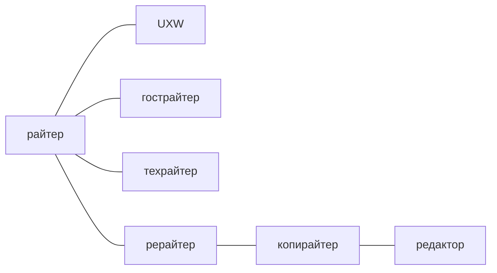
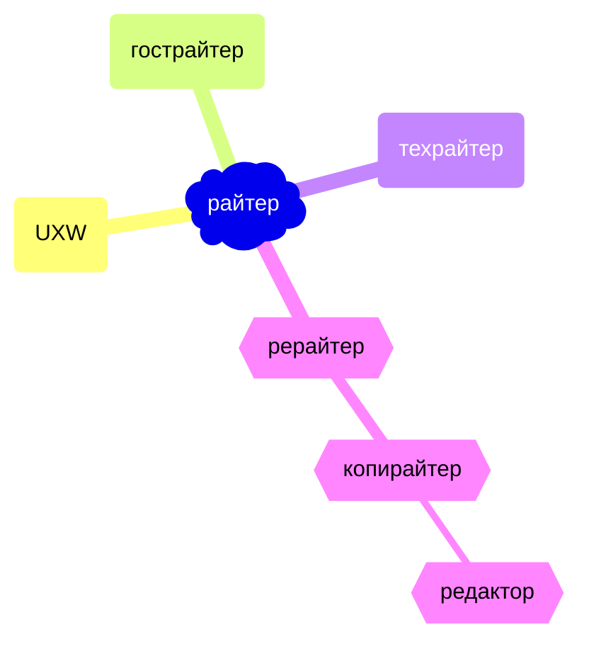
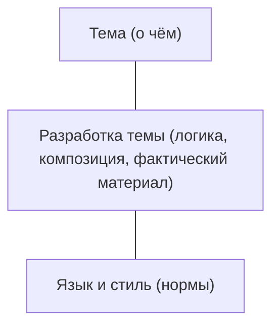
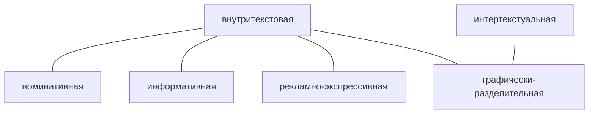

# Лекция № 2 Технологии редактирования


## Редактирование как технологический процесс

<!---
```

-->




**UXW** - User eXperience Writer.  

Утвержден профессиональный стандарт технического писателя. Значит, что профессия узаконена. 

гострайтер -- ghostwriter пишет за других. 

Рерайтер -- переписывает текст. Как правило чужой.  Не имеет право на самом простом языковом уровне ничего менять в тексте. 

Копирайтер -- это писатель, но это писатель который существует только в маркетинговой среде. Маркетинговых коммуникациях: PR  и реклама. Для многих копирайтер -- это простой писатель.  Функционал -- это не всегда означает текстовик (продающие, цепляющие). Копирайтер -- прежде всего идеолог продвижения. 

Редактор -- уникальная фигура. Интересен своей миссией. Более всего озабочен интересами читателя. Редактор озабочен этим по другому. Ему интересно чтобы текст не просто попал в цель, а чтобы текст бы удобен понятен, комфортен и т. д. Редактор вмешивается в содержание и ещё как вмешивается. Редактор может не просто вмешаться, но и дописать, переписать и поставить под сомнение некоторые фрагменты текста. 


### Аспекты анализа



>Уважаемые господа!
>С удовольствие представляем Вам новую серию конфет АССОРТИ из настоящего шоколада — темного и молочного.
>Попробовав любую конфетку, вся палитра вкусов и ощущений наполнит Вас радостью и наслаждением.
> Издавна настоящий шоколад считали эликсиром любви, средством, вызывающим прилив бодрости и вдохновения.
> Шоколадные конфеты АССОРТИ давно перестали быть просто угощением, это символ дружбы и любви, культурных традиций и этикета, благородства и утонченности вкуса.
> Этот набор шоколадных конфет в оригинальной праздничной упаковке доставит незабываемые минуты шоколадного удовольствия и будет великолепным подарком!
> С любовью к Вам. «Красный Октябрь»


### Заглавие: функции




Номинативная -- называние. Называние не означает раскрытие содержания текста.

Информативная -- функция предполагающая что заглавие раскрывает содержание. 

Рекламно-экспрессивная -- функция привлечения внимания. 

Графически-разделительная -- как заглавие сосуществует в другими заголовками.  

[[Лекция № 1 Технологии редактирования]]

[Пред. Лекция № 1 Технологии редактирования](https://github.com/denisbolshakoff/MSU/blob/main/Технологии%20редактирования/Лекция%20№%201%Технологии%20редактирования.md)