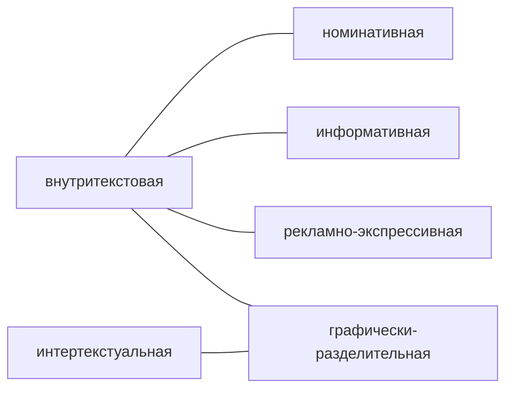
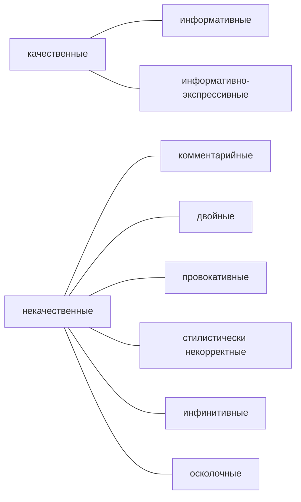

# Лекция № 3 Технологии редактирования

## Редактирование как технологический процесс

Всегда начинаем с темы. На этом этапе -- работе с темой -- для нас очень важны два момента:
1. Определить доминантную тему. Очень большое количество текстов стараются удержаться в рамках какой-то одной темы. При составления плана следуя за автором. Если вы понимаете, что у вас не простой текст и выделить одну тему достаточно трудно, вы выделяете микротемы и присваиваете им заголовки. Если выписать на листок, только темы, то весь текст будет как на ладони. Как их можно переставить. Но они должны быть реально простые без номинатива.  
2. Помогает справится с многотемными, невыстроенными текстами. Если книга, то там работа с авторским оглавлением. В малых жанрах, пусть даже несколько страниц, эта опция бывает полезная. Вспоминаем наши конфеты "==Красный Октябрь==", каждый абзац -- микротема.  Тема не раскрыта. Тема не затронута. 

Заголовок -- крайне важный элемент текста. Относится к структуре текста. Есть мнения, что нужно заголовок нужно в последний момент оценивать. 

Ряд научных изданий требуют выписывать ключевые слова (keywords), из которых складываются заголовки. 

Тема, заявленная автором живёт в заглавии. Именно заглавием он сверяет содержание. Автор знает свой текст и выдает некую схему, которая кажется ему привлекательной. Но читателя это может сбить с толку. 

### Заглавие: функции

### Заглавие: виды

`Информативные` -- 100% отражают содержание. (заглавие абреже или заглавие аннотация). "**Госдума на пленарном заседении во вторник приняля в первом чтении законопроект об универсиальном пособии для семей с детьми и беременных**"

`Информативно-экспрессивные` -- есть игровой элемент и имеет две функции, информативные и аттрактивные. Экспрессивный синтаксис, осколочные конструкции, парцеляция. 

`Комментарийные` -- заглавие в которые авторы через заголовок навязывают своё мнение читателю. с ними нужно быть осторожными. они полностью не не качественные (закон достаточного основания --- самый некорректный закон формальной логики). Иногда закон нарушается. **Самый долгожданными событием для москвичей стала выставка растений**, **Все россияне с волнением наблюдают за браком Александра Петрова**, **Нужны новые средства для...** (в последнем заголовке вводим диктат)

`Провокативные` -- чистая спекуляция. даже не кликбейт. технология кликбейта уже узаконилась и никуда не денется. мы будет жить с кликбейтом. Но измениться её. Информационная ситуация уже не позволяет обманывать читателя. 

`Двойные` -- очень и очень опасны -- пересечением смысла и логическом неоднородностью.  Размывают тему статьи. **Долги и внесудебное банкротство**, **Человеческий фактор и опустынивание земель**. Можно использовать двойной заголовок, но осторожно и осветить две темы. 

`Инфинитивные` -- начинается с инфинитива (выдать, сделать, выдать и т. д.) **Выдать кредит всем желающим...**, **Совершенствовать технологии обучения...**. Эта неопределенность снижает качество информативной функции. 

`Осколочные` -- выносим в заглавие самый интересный кусок текста. **Чтобы принять решение...**, **Когда уже поздно...**. 

`Провокативные` -- **Чернышов бросил больную Заворотнюк**, **Википедия врёт: Асмус раскрывал семейную тайну**

Заглавие документа -- очень важно и помогает читателю быстрее найти документ. 

### Заглавие: технологии создания

|       |                                               |
| ----- | --------------------------------------------- |
| ==TACT==  | ==T==aste(вкус)                                   |
|       | ==A==ttractiveness(привлекательность)             |
|       | ==C==larity(понятность)                           |
|       | ==T==ruth(правда)                                 |
|       |                                               |
| ==4U==    | ==U==sefulness (польза, выгода)                   |
|       | ==U==niqueness (уникальность)                     |
|       | ==U==ltra-specifity (прицельность, специфичность) |
|       | ==U==rgency(срочность) + k (ключевые слова)                                              |
|       |                                               |
| ==5w==    | ==w==hat, ==w==ho, ==w==hy, ==w==hen, ==w==here                   |
|       |                                               |
| ==AIDMA== | ==A==ttention, ==I==nterest, ==D==esire, ==M==otivation, ==A==ction  |

#### Технология NLP
*Императив* -- в заглавие вставляется подчинение. привлекает внимание возникает эффект сопричастности (`приходите, узнайте первым и пр.` ) 

*Вопросительный заголовок* = эвристические вопросы: что, кто, где, когда, почему. с одной стороны неплохо, с другой стороны вопросительный заголовок не является полностью информативным.  (`почему россияне предпочитают`)

*Цифровой заголовок* -- любой перечень вызывает интерес, привлекает внимание. сейчас тренд немного исказился. продуктивные решения начинают эксплуатировать без разбора и это приводит к цифровому потопу, которые отталкивает (5 причин, по которым... 3 условия успешного)

*Читатель в* заглавии (`для начинающего свой бизнес`, `продвинутым пользователям`, `первые шаги фермера`)

*Приём "ноухау"*: со словом как (`увеличить свои доходы`...)

#### Синтаксические приёмы актуализации:

*Парцеляция*: `Второй отпуск: утвержден график праздников на 2022 год`; `Зимний загул: россиянам расписали праздники`.

*Сегментация* -- осколочные конструкции. берется развернутое предложение и делится на части. `Они переселились на запад. Их выбор`. 

*Вопрос-ответ (тема-рема)* относится к риторике. тема известная информация, рема дополнительная к ней. Постоянно добавляем новую информацию выстраиваем новую цепочку. `Вакцину? Только настоящую`, `Отдых? Только с комфортом`. 

Наиболее кликабельные от 55 до 60 знаков. Именно на развернутые заголовки. Семь слов. 

#### Что может помочь?

Использовать эти приёмы грамотно помогает насмотренность. Ресурсы **рбк _тренды**, **setters** агентство

Существует заголовок, который является дресс-кодом. Трехчастный заголовок с активным глаголом. Для пресс-релизов и для информационных жанров трехчастный заголовок с активным глаголом очень подходит. Обязательно должен быть субъект действия (`московский государственный университет`), дальше `провел`,  `организовал` , дальше `первую встречу`, `форум` и т. д. 

### Правка

| *характеристики* ->    | *когда используется*                                                                                                                                                          | *приёмы*                                                                                                             | *особенности*                                                                                                                          | *возможные трудности*                                                                                                                         |
| ------------------- | ----------------------------------------------------------------------------------------------------------------------------------------------------------------------------- | -------------------------------------------------------------------------------------------------------------------- | -------------------------------------------------------------------------------------------------------------------------------------- | --------------------------------------------------------------------------------------------------------------------------------------------- |
|                     |                                                                                                                                                                               |                                                                                                                      |                                                                                                                                        |                                                                                                                                               |
| `Виды правки`       |                                                                                                                                                                               |                                                                                                                      |                                                                                                                                        |                                                                                                                                               |
|                     |                                                                                                                                                                               |                                                                                                                      |                                                                                                                                        |                                                                                                                                               |
| `Правка-вычитка`    | - при подготовке переизданий (как самостоятельный вид)                                                                                                                        | - чтение текста насквозь                                                                                             | знание и понимание отличий от корректорской правки                                                                                     | - выбор авторитетного источника,                                                                                                              |
|                     | - перед сдачей текста в набор                                                                                                                                                 | - чтение текста "наоборот", то есть от конца к началу                                                                |                                                                                                                                        | - необходимость обеспечить внимательное профессиональное чтение                                                                               |
|                     |                                                                                                                                                                               | - внимание к тексту, набранному шрифтом большего кегля                                                               |                                                                                                                                        | - унификаций                                                                                                                                  |
|                     |                                                                                                                                                                               | - сличение цифр, дат (сопоставление), названий                                                                       |                                                                                                                                        | - необходимость принимать оправданные методические решения                                                                                    |
|                     |                                                                                                                                                                               | - унификация                                                                                                         |                                                                                                                                        |                                                                                                                                               |
|                     |                                                                                                                                                                               | - проверка нумерации ссылок на источники, нумерации иллюстраций                                                      |                                                                                                                                        |                                                                                                                                               |
|                     |                                                                                                                                                                               |                                                                                                                      |                                                                                                                                        |                                                                                                                                               |
| `Правка-сокращение` | - многословие (плеонастичность), растянутость текста в целом                                                                                                                  | - отказ от однотипных данных                                                                                         | - тщательная проверка и восставление логический связей между фрагментами текста и грамматических, синтаксических -- внутри предложения | - искажение смысла при сокращении                                                                                                             |
|                     | - несоразмерность основной части, введения и заключения                                                                                                                       | - вычеркивание (удаление) фрагментов текста, "горизонтальная правка"                                                 | - при сокращении фактических данных проверять, чтобы эти факты не упоминались даже косвенно по ходу изложения                          | - необходимость сжимать информацию без потери смысла                                                                                          |
|                     | - загромождение однотипными фактами, примерами, подробностями, отступления от темы, заявленной в заглавии (см. ассоциативность)                                               | - сокращение внутри фразы ("стыковка" членов предложения)                                                            |                                                                                                                                        | - двойной контроль за повторяющимися по тексту фактическими данными (те, что устранены в начале текста, не должны появится по ходу изложения) |
|                     | - повторы, Но: учитывать вид литературы и жанр произведения                                                                                                                   | - отсылки: не пересказ, а отсылка к источнику                                                                        |                                                                                                                                        |                                                                                                                                               |
|                     | - прописные истины и мнимые рассуждения                                                                                                                                       | - использование условных сокращений и аббревиатур                                                                    |                                                                                                                                        |                                                                                                                                               |
|                     |                                                                                                                                                                               | - отказ от абзацев. но помнить о роли и значении абзацев в тексте                                                    |                                                                                                                                        |                                                                                                                                               |
|                     |                                                                                                                                                                               | - использование визуализации (таблицы, диаграммы, графики, рисунки и пр. )                                           |                                                                                                                                        |                                                                                                                                               |
|                     |                                                                                                                                                                               |                                                                                                                      |                                                                                                                                        |                                                                                                                                               |
| `Правка-обработка`  | оптимизация неплохого по содержанию и качеству исполнения текста (поиск и дополнение фактических данных, перестройка композиция, устранение языково-стилистических недочётов) | совокупность приёмов, используемых при всех видах правки                                                             | установка на сохранение авторской концепции произведения                                                                               | - необходимость, дополнять фактический материал, обновлять данные                                                                             |
|                     |                                                                                                                                                                               |                                                                                                                      |                                                                                                                                        | - перестройка структуры, план "следуя за автором"                                                                                             |
|                     |                                                                                                                                                                               |                                                                                                                      |                                                                                                                                        | - "риск" соавторства                                                                                                                          |
|                     |                                                                                                                                                                               |                                                                                                                      |                                                                                                                                        |                                                                                                                                               |
| `Правка-переделка`  | - всё плохо, но публиковать надо по ряду причин: статус автора, административное решение, нет возможности / времени снимать вопросы и пр.                                     | практическая те же приёмы, что при созданпии нового произведения с учётом вида, формата, источника публикации текста | полное совмещение авторских и редакторских функций                                                                                     | - погружение в незнакомую тему,                                                                                                               |
|                     | - нужно изменить жанр (очерк - зарисовка, статья - заметка и т. д.)                                                                                                           |                                                                                                                      |                                                                                                                                        | - адаптация под определеную стилевую манеру в соответствии со статусом титульного автора                                                      |
|                     | - нужно изменить читательский адрес: из научной сделать научно-популярному, из журналистского текста -- образовательный и пр.                                                 |                                                                                                                      |                                                                                                                                        |                                                                                                                                               |
|                     | - автор знает предмет, но не владеет грамотной письменной речью (литзапись)                                                                                                   |                                                                                                                      |                                                                                                                                        |                                                                                                                                               |

[[Лекция № 2 Технологии редактирования]]

[Пред. Лекция № 2 Технологии редактирования](https://github.com/denisbolshakoff/MSU/blob/main/Технологии%20редактирования/Лекция%20№%202%20Технологии%20редактирования.md)