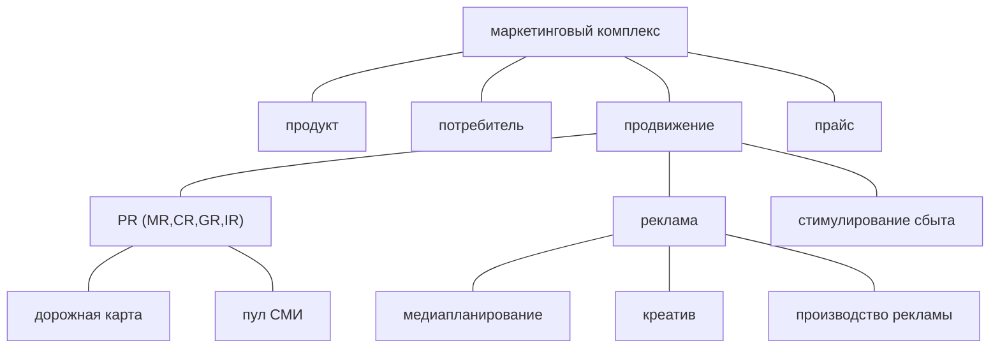
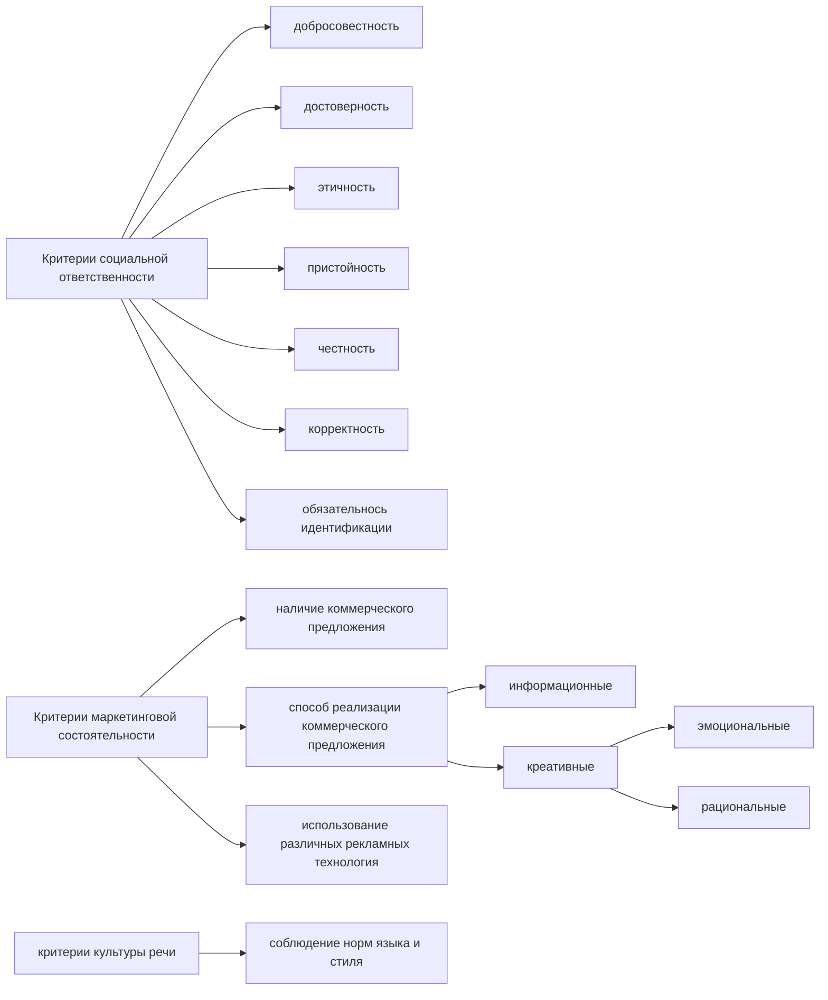

# Лекция № 4 Технологии редактирования

> Если цель текста не ясна, то текст писать не нужно. 

## Заголовок

На стыке цели и целевой аудитории находится жанр. Но для нас с вами жанровые граница нужно обязательно представлять. Если отчёт, то жанр отчета. 

Не умеют студенты определять существенную информацию в тексте. `О чём текст?` Ватность темы, создает ватность текста.

Всегда старайтесь конкретизировать темы, чтобы всегда было понятно о чём текста. Если мы даже работаем с другими видами материала.

В информационном жанре мы ориентируемся только на повод. Потом добавляем ракурс. Может быть необычный. Потому что в итоге заголовок может быть единственное что прочитает читатель. Заголовки не о чём уже абсолютно никому не нужны. Сейчас это потеря времени, потеря потенциального читателя.

Информативный заголовок -- это замечательно и в пресс-релизе должен быть информативен. Довольно строгий принцип. Трехчастный: субъект, объект и действие. 

## Редактирование рекламный и PR-текстов

Технологии редактирования приложима к абсолютно любой области. Это технологию можно использовать с какой бы литературой вы не работали.  Ровно также это имеет отношение к предметной области. 

В каждой научной сфере существуют рецензенты. Солидные медиа имеют экспертов. Сохранилось понятие так называемого научного редактора, который отвечает за содержание.  

### Маркетинг

#### Определения

`Реклама` представляет собой неличные коммуникации, осуществляемые через платные средства распространения с чётко указанным источником финансирования (Ф. Котлер). 

`Реклама` -- это умение продавать. Её методы воздействия совпадают с методами, которыми пользуется хороший продавец (К. Хопкинс). 

`Связи с общественностью` -- это система коммуникационных техник, предназначенная для оптимизации коммуникационной среды базисного субъекта (А. Д. Кривоносов).

 `PR` -- это искусство и наука достижения гармонии посредством взаимопонимания, основанного на правде и полной информированности (С. Блэк). 

#### Таблица деления по видам коммуникации

| **Виды коммуникации**                                      | **Реклама**                                                         | **Связи с общественностью (пиар)**                                                | **Медиа**                                               |
| ---------------------------------------------------------- | ------------------------------------------------------------------- | --------------------------------------------------------------------------------- | ------------------------------------------------------- |
| `Цель (для чего)`                                          | Продать                                                             | Вести диалог. Убеждать. Информировать. "Паблицитный капитал"                      | Информировать, формировать общественное мнение          |
| `Аудитория (для кого)`                                     | Любые категории потребителей                                        | Общественность, нужная базисному субъекту                                         | Читатели конкретного медиа                              |
| `Что (о чём)`                                              | Товары, услуги, идеи, персоны                                       | Базисный субъект и его деятельность                                               | События и являения в соответствии с профилем/ тематикой |
| `Заказчик/инициатор`                                       | Есть. Рекламодатель (компания или персона)                          | Есть.  Компания или персона                                                                | Редакция (не должность быть заказчика в маркетинговом смысле)                                                        |
| `Авторство`                                                | Нет                                                                 | нет                                                                               | есть                                                    |
| `Стиль`                                                    | Яркость, эмоциональность, привлекательность, стилевая вариативность | Нейтральность, отсутствие императивности, модальности нейтральная предикативность | Индивидуальный стиль автора + стилевой формат издания   |
| `Финансирование (размещение / распространение информации)` | Оплачивается / бартер                                               | Не должно оплачивается                                                            | Не должно оплачивается (гонорар / зарплата журналиста)  |

#### Критерии оценки рекламных (маркетинговых) обращений

#### Виды рекламы
* реклама в медиа (ТВ, радио, периодические издания);
* печатная реклама (буклеты, проспекты, листовки, плакаты и т. д.);
* реклама наружная (outdoor);
* реклама внутренняя (indoor);
* реклама в книжных изданиях;
* сувенирная реклама;
* диджитал-реклама (все виды);

#### Жанры рекламы
* информационные (рекламное объявление, интервью, отчёт, репортаж);
* аналитические (статья, корреспонденция, комментарий, рецензия, обзор);
* образные (очерк, зарисовка, колонка, эссе, житейская история).

> **Креатив**
> *Один из самый трудных моментов, когда только начинаешь писать рекламный текст, - научится тому, как это не надо делать*
> *Аллан Кромптон*

> * *Реклама на самом деле -- это очень простая вещь с точки зрения экономики. Она просто заменяет продавцов.* 
> * *Русские до тех пор не научатся делат хлорошую релкаму, пока не поймут, что надо ориентировать на потребителя, а не производителя*
> * *В рекламной объявлении могут найти отражения пять, десять, пятнадцать аспектов, но потребитель скорее всего остановит свое внимание только на одном или попытается, как умеет, свести их вместе в некую собственную идею. Не стоит ставить потребителя в затруднительное положение.*
> *Ровсес Рисс*

> * Креатив -- процесс информационного и эмоционального направления рекламной коммуникации, главной характеристикой качества которого является его способность продавать
> * Вас будут учить креативить. не позволяетй себе поддаваться этому, Учитесь быть информативными
> * Не пытайтесь учиться креативу. Креатив -- это ваш интеллект, фантазия, но главное знание технологии и желания понять потребителя
> * Вы не имеет права обманывать -- это незаконно и невыгнодно. Но ваша связанность обязанность помочь потребителя в самообмане
> * Не надо боятся создать новую идею. Скорее всего всего вы действительно не можете этого сделать.  

#### Виды PR
* По адресату: внешний и внутренний (MR, GR, IR, SR, персональный PR/ руководитель) (MR - media relations,IR - investor relationship, SR -- science relationship, GR -- goverment relationship)
* по характеру информации: коммерческий, политический и социальный
* по цветам:  черный, белый, серый

#### Жанры PR
* информационные: пресс-релиз, приглашение, факт-лист, лист вопросов и ответов (question and answer form Q & A);
* аналитические: статья, бэкграундер, заявление для СМИ (position paper)
* образные (байлайнер, поздравление, письмо)

#### Пресс-релиз как базовый PR-жанр
* событийный повод -- новости компании, участие в профильных мероприятиях, продвижение через персоны (в качестве экспертов), спецпроекты, изучение информационного поля и пересечение с актуальной повесткой),
* оперативность,
* непрерывность: маркетинговые (акции) и медийные (юбилеи и пр.) -- дорожная карта,
* формализованность содержание и формы,
* предназначенность для распространения в СМИ.

[[Лекция № 3 Технологии редактирования]]

[Пред. Лекция № 3 Технологии редактирования](https://github.com/denisbolshakoff/MSU/blob/main/Технологии%20редактирования/Лекция%20№%203%20Технологии%20редактирования.md)